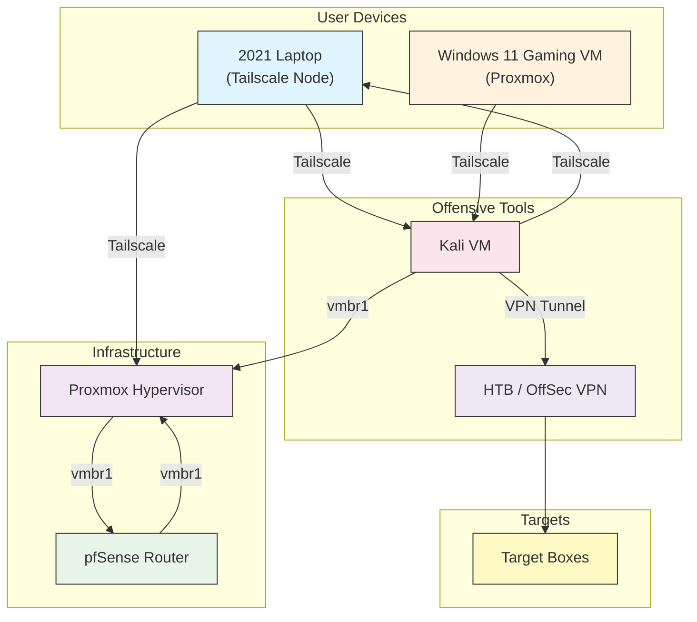

```mermaid
flowchart TD
  %% Grouped nodes for clarity
  subgraph "User Devices"
    A["2021 Laptop<br/>(Tailscale Node)"]
    B["Windows 11 Gaming VM<br/>(Proxmox)"]
  end

  subgraph "Infrastructure"
    C["Proxmox Hypervisor"]
    D["pfSense Router"]
  end

  subgraph "Offensive Tools"
    E["Kali VM"]
    F["HTB / OffSec VPN"]
  end

  subgraph "Targets"
    G["Target Boxes"]
  end

  A -->|Tailscale| E
  A -->|Tailscale| C
  B -->|Tailscale| E
  E -->|vmbr1| C
  C -->|vmbr1| D
  D -->|vmbr1| C
  E -->|VPN Tunnel| F
  F --> G
  E -->|Tailscale| A

  style A fill:#e1f5ff,stroke:#333,stroke-width:1px
  style B fill:#fff3e0,stroke:#333,stroke-width:1px
  style C fill:#f3e5f5,stroke:#333,stroke-width:1px
  style D fill:#e8f5e9,stroke:#333,stroke-width:1px
  style E fill:#fce4ec,stroke:#333,stroke-width:1px
  style F fill:#ede7f6,stroke:#333,stroke-width:1px
  style G fill:#fff9c4,stroke:#333,stroke-width:1px
```
