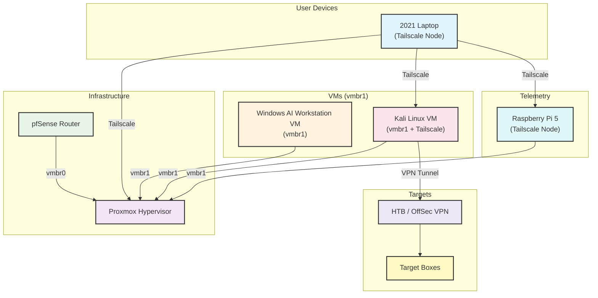

# Network Topology

```mermaid
flowchart TD
    %% ── User Devices ──────────────────────────────
    subgraph "User Devices"
        A["2021 Laptop<br/>(Tailscale Node)"]
    end

    %% ── Infrastructure ────────────────────────────
    subgraph "Infrastructure"
        C["Proxmox Hypervisor"]
        D["pfSense Router"]
    end

    %% ── VMs on Proxmox ───────────────────────────
    subgraph "VMs (vmbr1)"
        B["Windows AI Workstation VM<br/>(vmbr1)"]
        E["Kali Linux VM<br/>(vmbr1 + Tailscale)"]
    end

    %% ── External Targets ─────────────────────────
    subgraph "Targets"
        F["HTB / OffSec VPN"]
        G["Target Boxes"]
    end

    %% ── Telemetry ────────────────────────────────
    subgraph "Telemetry"
        H["Raspberry Pi 5<br/>(Tailscale Node)"]
    end

    %% ── Connections ──────────────────────────────
    A -->|Tailscale| C
    A -->|Tailscale| E
    A -->|Tailscale| H

    B -->|vmbr1| C
    E -->|vmbr1| C
    H -->|vmbr1| C

    D -->|vmbr0| C

    E -->|VPN Tunnel| F
    F --> G

    %% ── Styling ──────────────────────────────────
    style A fill:#e1f5ff,stroke:#333,stroke-width:2px,color:#333
    style B fill:#fff3e0,stroke:#333,stroke-width:2px,color:#333
    style C fill:#f3e5f5,stroke:#333,stroke-width:2px,color:#333
    style D fill:#e8f5e9,stroke:#333,stroke-width:2px,color:#333
    style E fill:#fce4ec,stroke:#333,stroke-width:2px,color:#333
    style F fill:#ede7f6,stroke:#333,stroke-width:2px,color:#333
    style G fill:#fff9c4,stroke:#333,stroke-width:2px,color:#333
    style H fill:#e0f7fa,stroke:#333,stroke-width:2px,color:#333
```
